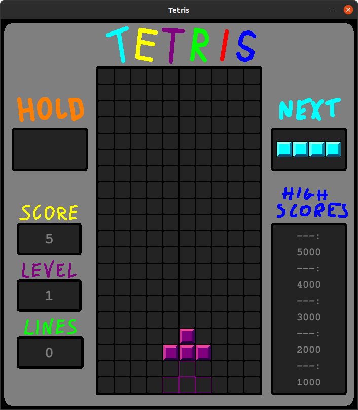
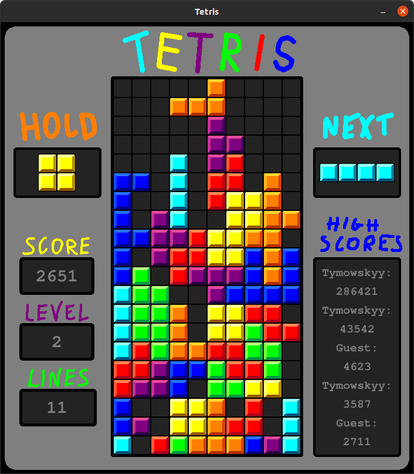
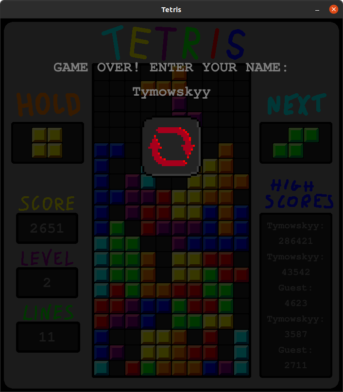
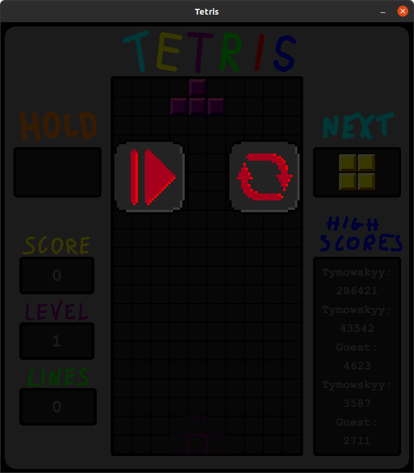

# Tetris
Pygame project, implementation of Tetris
## Installation
1. Using Python
    * Install Python3 (made on 3.8.10)
    * Install pygame module by ```pip install pygame```
    * Run ```main.py```
2. Using Build
    * View [dropbox](https://www.dropbox.com/sh/7l8ubd97m48bbz4/AAC9iWp_15UOQHIBCabNTibfa) with builds
    * Download version for your OS (Windos / Linux)
    * Unzip downloaded file
    * Run
        * For Windows ```Tetris.exe``` file
        * For Linux ```Tetris``` file
## Controls
* LEFT/RIGHT arrow - move block
* UP arrow - rotate block
* DOWN arrow - shift block down
* SPACE - drop
* C - hold
* ESC - pase game
* **ON END SCREEN**: Letters, digits and backspace - Type your nickname
* LMB - pause and end screen
## Features
* Game basics
* [SRS](https://tetris.wiki/Super_Rotation_System) - Super Rotation System
* Levels
* High Scores
* Pause
* T-Spins
* Hold
* Next block preview
## Screenshots
<p>
   
   
</p>
<p>
   
   
</p>

## Author
Tymoteusz Stępkowski - [tymowskyy](https://github.com/tymowskyy)
